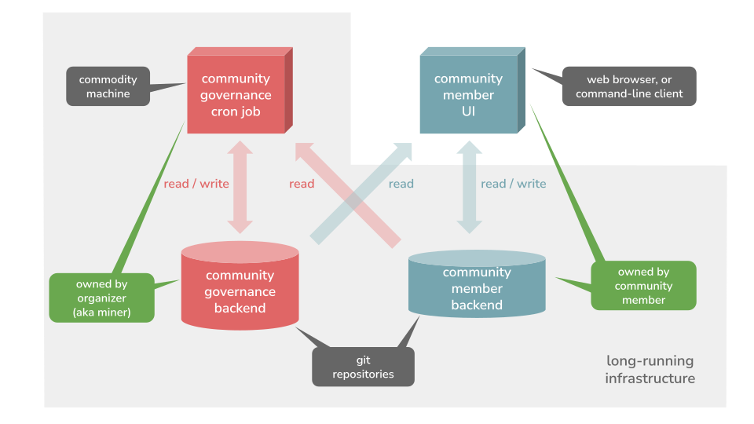

# Gov4git: Summary

## Mission and motivation

Our mission is to design governance software and protocols which enable people to bootstrap and grow pluralistic and transparent open source communities.

Two of the most useful functionalities for open source community governance are polls and referendums. Polls are commonly used for prioritizing work, such as issues or pull-requests. Whereas referendums are used for approving changes to the source of the community, its membership or its governing rules.

Every community is unique, which is why a successful governance software must accommodate different types of balloting mechanisms, ranging from traditional one-person-one-vote to modern approaches such as Quadratic Voting and all of its flavors. More generally, governance should be programmable.

Modern community mechanisms also utilize a range of community-scoped tokens (such as fungible/non-fungible, transferable/non-transferable) as a way of bookkeeping member contributions and mediating voting power. Therefore, no governance solution is complete without support for community-scoped member accounts and services for community-specific tokens.

## Constraints and requirements

First, we aim to support the entire life of a community. Communities grow from small to large, especially if successful. Large communities comprise individuals who are mutually distrusting. Therefore, a successful governance solution must ensure that member rights are enforced as advertised, e.g. polls and referendums cannot be "rigged" by higher-ranking members and can always be audited.

Second, it is our utmost priority to serve the tail case of users who are disadvantaged, reside in the developing world, or in disaster, war-torn or otherwise firewall-ed zones. They should be able to form local governed communities as well. To accommodate these cases, we require that our solution does not depend on connectivity to the global Internet and can operate on commodity hardware alone.

## Governance features

By design, our governance framework is easily extensible using the Go language, and soon using any programming language.

At the moment, we support the following governance features:

- Polling, using configurable and programmable tallying strategies
  - Quadratic Voting tallying, based on voting credits
- General-purpose community-scoped token accounts for members (used for voting credits, badges, and so on)
  - Account services for members (for operations such as transfers to other members)
- Logical member groups, used to target polls and other governance motions to specific subsets of members

Upcoming features:

- Referendums for approval of changes to a source repository or changes to the governing logic itself
- Experimental flavors of Quadratic Voting aimed at promoting diversity of opinions

## Software abstraction

From a software developer perspective, a governance application can be described succinctly by two standard abstractions. Governance is a:

- _Decentralized social application_: Community governance entails the interactions of its members. It requires an identity system and a method for asynchronous communication.

- _Shared state machine_: All community members must agree on a unified view of community affairs, such as current governing rules, past decisions, referendum outcomes, and so on.

## Related work

The current Web3 ecosystem provides "textbook" solutions for both of the software abstractions required by governance. [Inrupt](https://www.inrupt.com/), [Matrix](https://matrix.org/), [Mastodon](https://joinmastodon.org/) and [BlueSky](https://atproto.com/docs), for instance, offer alternative software architectures for building decentralized software applications. Whereas blockchains like [Ethereum](https://ethereum.org/en/foundation/), [Solana](https://solana.com/) or [Tendermint](https://tendermint.com/), for example, can be used to implement an application-specific shared state machine.

Unfortunately, none of these solutions meet our requirements for operation in disconnected regions of the world with commodity infrastructure at hand.

## Technical solution

Our governance application is built on top of two software (and protocol) frameworks:

- One, for building decentralized social applications, using only git as a backend infrastructure while deferring all computation to the client (such as a web app). This framework provides an identity system and a method for communication to application developers.

- Second, for building governance-specific replicated state machines (i.e. blockchains), using git as a storage backend and commodity hardware (such as a Raspberry Pi) for execution. This framework provides execution and state replication to application developers.

It is noteworthy how and why we are able to build a blockchain with low infrastructure requirements. The source of high infrastructural demands in traditional blockchains stems from expensive application-agnostic mechanisms (e.g. proof-of-work, proof-of-stake, proof-of-storage) for conflict resolution between competing applications. In contrast, community governance runs as a single application on a dedicated blockchain. Conflicts in a governance application can arise only between user requests. These are application-specific conflicts which are definitionally resolved at the application level, using human-centric protocols such as referendums, quorums, approvals, and so on. 

## Deployment and infrastructure

Community governance involves two types of deployment: one for the governance itself and one for each community member.

- The community _governance deployment_ is administered by a trusted party, which we call a community _organizer_ (or a community _miner_). It entails a git repository with a public URL, and a commodity machine for executing periodic (i.e. cron) jobs. A typical deployment can be accommodated by a GitHub repository and a GitHub action, for example.

- Each community member administers their own _member deployment_, which entails a git repository with a public URL. No other infrastructure is required by individual users.

## Principle of operation

The community organizer owns the governance repo and operates the governance cron job. They have read/write accesses to the repo, and they provide read access to the public.

Each community member owns their repository, and they interact with the application using a web UI (in the browser) or a command-line client. A community member has read/write access to their own repository, and they provide read access to the public.

Communication between a member and the community governance is accomplished using a "drop box" mechanism. For instance, when a member is casting a vote, they deposit the vote in their own repository. At a later point, the governance cron job picks up the vote and updates the governance repository.

## Trust model

A community governance deployment entails at least one, optionally more, governance miners. Each governance miner maintains a replica of the current state of the governance application. Additionally, each miner is responsible for collecting requests from all community members and progressing the state of the application, based on those. Miners use a reliable Byzantine broadcast protocol to stay synchronized and overcome up to 33% of Byzantine faults.

Our MVP implementation supports a single miner deployment only. This deployment is appropriate for communities that have a trusted organizer.

## Application development model

Traditional blockchains use a VM-based architecture to execute application code. VMs provide isolation and portability. Unfortunately, VMs also necessitate the use of experimental development environments, such as languages like [Solidity](https://soliditylang.org/), [AssemblyScript](https://www.assemblyscript.org/) or [WASM](https://webassembly.org/). This prevents relatively easy, rapid and accessible iteration and experimentation with application designs.

In our governance-specific blockchain architecture, the blockchain framework interfaces with the application purely through the file system. The application can be provided as a separate UNIX process or can be linked with the blockchain in a single binary.

This approach makes the development of governance applications approachable to a wide range of engineers, who can use a programming language of their choice.

Note that avoiding the use of a VM has no impact on performance or security for governance applications specifically, because:

- Our architecture runs a single governance application on the blockchain, thus no isolation is necessary

- Governance transactions have very low bandwidth, because they correspond to human-centric events, such as the opening and closure of a ballot, for example.
